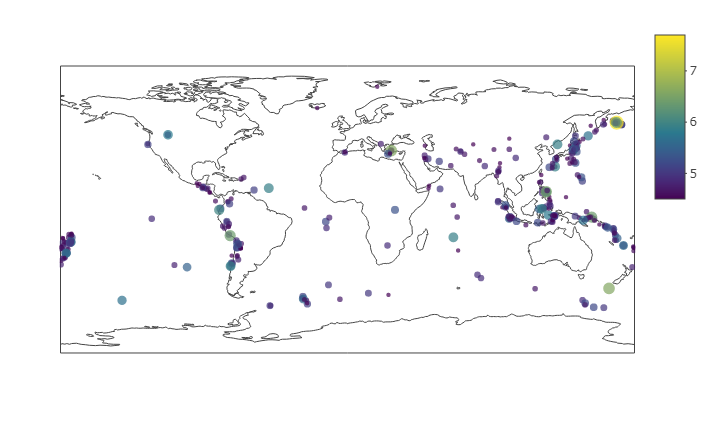

# HTML Slideshow: 30 Days, Magnitude 4.5+ World latest Eartquakes

Data taken from:

https://earthquake.usgs.gov/earthquakes/

Updated: 2017-07-30 21:55:42 (UTC)

    library(readr)

    library(plotly)

    df <- read.csv("4.5_month.csv")

    plot_ly (type = 'scattergeo' ,lon =df$longitude ,lat =df$latitude, 
             text =df$place ,mode = 'markers', color=df$mag, size = df$mag )
             
             
 
